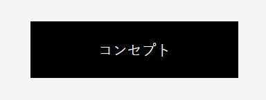
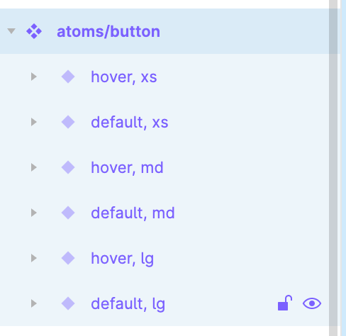
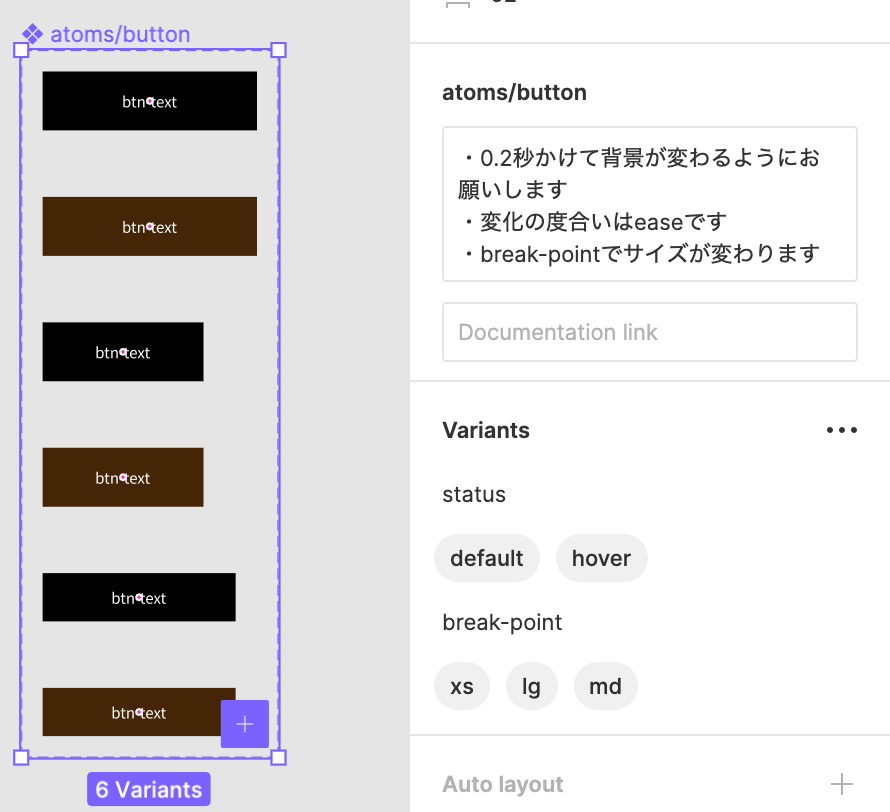
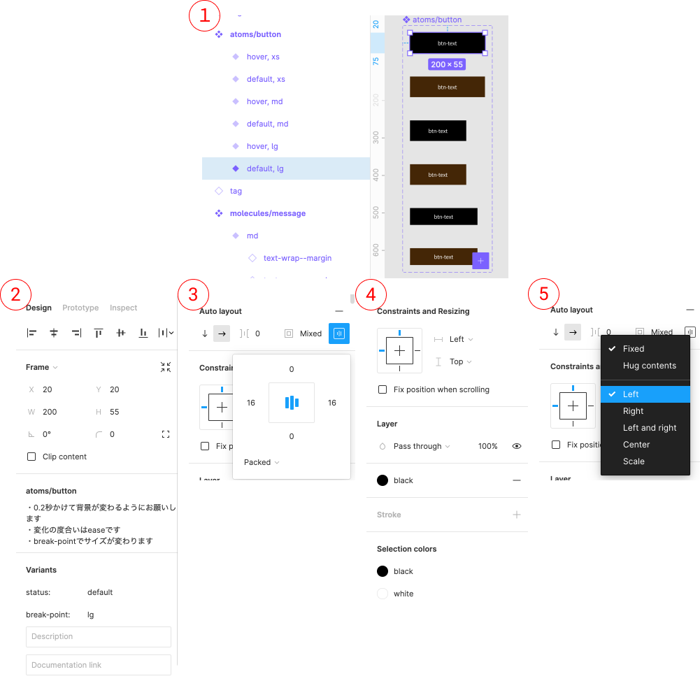
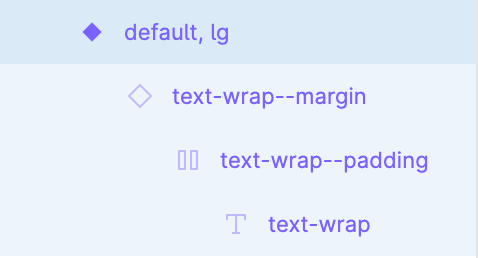
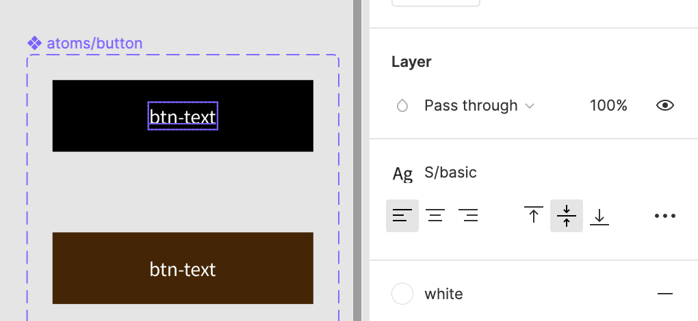

### 作るもの



### ファイル名、ディレクトリ構造

```
src
├ components
│ └ atoms
│   └ button
│     ├ button.html
│     └ button.scss
└ stories
  └ atoms-button.stories.js
```

### Figma の見方

atoms/button のあるページ: [共通パーツ](https://www.figma.com/file/itngQHR9R5RB7xwCXAKOde/?node-id=818%3A0)

#### コンポーネントのパターンを見る

atoms/button を選択して以下の状態を見てみましょう。

| 左サイドバーの様子                      | 該当コンポーネントと右サイドバーの様子    |
| --------------------------------------- | ----------------------------------------- |
|  |  |

atoms/button コンポーネント(４つのひし形のマーク)は`6 Variants`とあるように、6 つの状態が存在します。  
どんな状態かは右サイドバーの Variants に書いてあります。(status ２種類 × break-point3 種類)  
Variants の上にはコンポーネントの考慮すべき点が書いてあります。  
参考にしてください。

#### コンポーネントの様子を見る

１つのパターンに注目して見てみましょう。

```
1: コンポーネントの１つのパターンを選択した状態の左サイドバーの様子
2~5: 右サイドバー
```

- 1 のパーツの名前や 2 番から`default`,`lg`の場合のコンポーネントの状態であることがわかると思います。
- 2 の上部が何を示しているかは[このページ](https://help.figma.com/hc/en-us/articles/360039956914-Adjust-alignment-dimensions-rotation-and-position)を参考にしてください。
- 3 は [Auto Layout](https://help.figma.com/hc/en-us/articles/360040451373-Create-dynamic-designs-with-Auto-layout) です。  
  右のアイコンをクリックすると画像のようなウィンドウが表示され、詳細が確認できます。
- 4 はサイズが変わった場合などの振る舞い・制約や、このパーツに使われている色が示されています。  
  width の制約が書いてある Left のドロップダウンメニューをクリックすると 5 のようなウィンドウが表示されます。
- 5 は width が中身よって変わるのではなく、固定(Fixed)であることを示しています。Left はこのパーツでは関係ありません。



#### コンポーネントの中身を見る

左サイドバーからコンポーネントを展開していくと以下のようになると思います。

ひし形のマークはインスタンスといい、コンポーネントをコピーしたものです。  
このインスタンスの内容は[Shinonome のテキスト](https://design-basic.netlify.app/web/section2-1/)という部分を参照してください。
margin,padding の名前の通り、１つ１つ子要素を選択して、余白がつけられているかどうか確認するようにしましょう。  
1 番子要素の`T`のアイコン text-wrap を選択すると、右サイドバーにどのフォントがつけられているか確認することができます。  
フォントスタイルの確認は前のページで習いましたね。


### 注意点

- ページの様々な場所で使われる部品です。使い回すことを考えながら作成しましょう。
- ホバー時の挙動や、画面の幅ごとの見た目を再現しましょう。
- 画像は一例です。中のテキストを変えても見た目が崩れないように作成しましょう。
- 本課題において、a タグ等の遷移先はダミー（"#"など）で結構です。
- ボタンですがリンクの機能しか持たないため a タグで作成しましょう。
