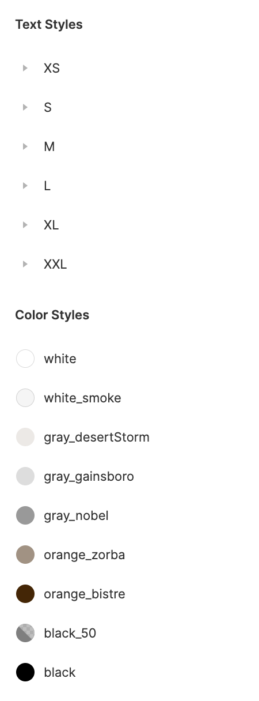
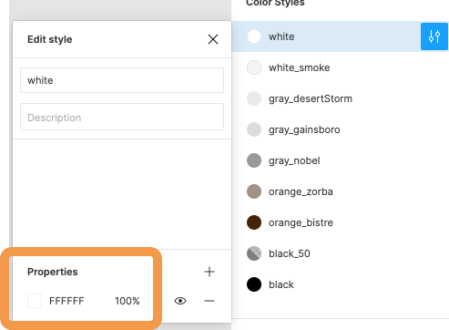
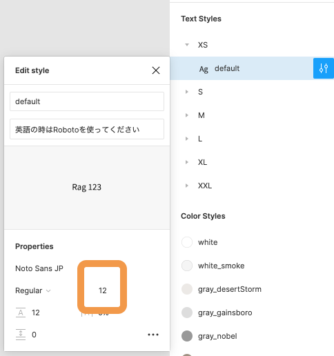

### ファイル名、ディレクトリ構造

```
src
 └ components
   └ _variables.scss
   └ utilities.scss
```

### やること

1\. 実際に html と scss を描き始める前に、ひとつ前のページで書いてあったように、この課題で使用するカラーやテキストを変数で管理しましょう。  
書き方はひとつ前のページを参考にしてください。  
Figma の[プロジェクト](https://www.figma.com/file/itngQHR9R5RB7xwCXAKOde/TCD-Theme)をクリックして右サイドバーを見てみましょう。  
  
これらが実装に使うカラーやテキストのリストです。  
この情報を元に`_variables.scss`に、定義をしていきましょう。

- 1.1 色の定義  
  定義したいカラーをホバーすると調節アイコンが表示されます。  
  そのアイコンをクリックして現れるウィンドウを見てみましょう。  
  下の画像の枠線で囲われた部分にカラーコード・透明度が載っています。  
  このように情報を見て色を定義しましょう。  
  カラーの名前をそのまま変数名に使いましょう。
  

- 1.2 文字サイズの定義  
  定義したいテキストをホバーすると調節アイコンが表示されます。  
  そのアイコンをクリックして現れるウィンドウを見てみましょう。  
  下の画像の枠線で囲われた部分にサイズが載っています。  
  このように情報を見て文字を定義しましょう。  
  XS,S などの名前をそのまま変数名に使いましょう。  
  他の項目も今後見る必要が出てくるので参照の仕方を覚えておきましょう。
  

- 1.3 文字の種類の定義  
  Figma で定義されているように、フォントは`Roboto`と`Noto Serif JP`と`Noto Sans JP`を使います。  
  [Google Font](https://fonts.google.com/) から３種類のフォントをとってきて、`$fontfamily-mincho`と`$fontfamily-gothic`という変数で呼び出せるようにしてください。  
  また、ロードしてから Google Font が読み込まれるまでのわずかの時間でも明朝体かゴシック体別でフォントを表示しておきたいです。したがって、デフォルトで OS に入っているフォントを定義しておくようにしてください。

- 1.4 ブレークポイントの定義  
  これは Bootstrap で用いられている値を使います。Bootstrap の課題を思い出して定義してください。

2\. これから作成サイトはたいていゴシック体で書かれています。そのため、`utilities.scss`で、ページ全体の`font-family`がゴシック体になるようなコードを描きましょう。このとき、先程定義した`fontfamily-gothic`を使うようにしましょう。
