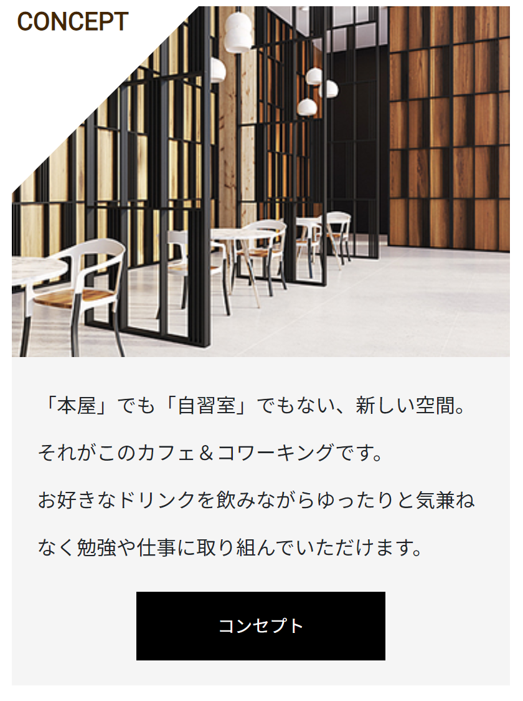
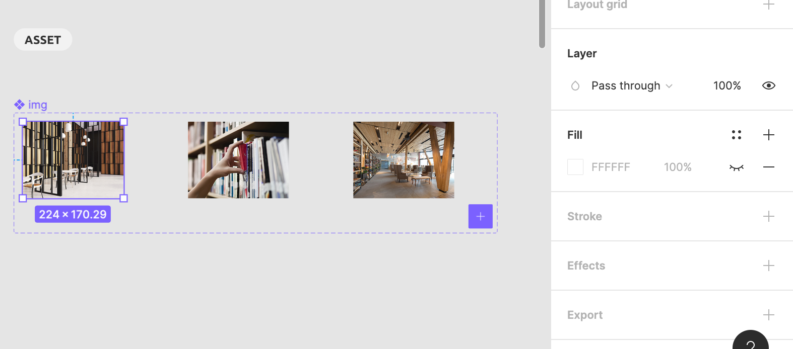
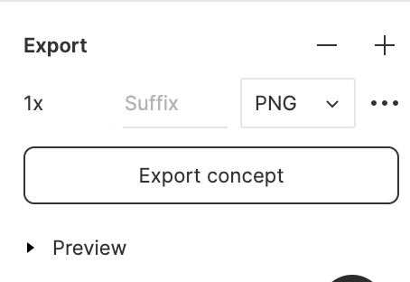

### 作るもの



### ファイル名、ディレクトリ構造

```
src
├ components
│ └ molecules
│   └ card
│     ├ card.html
│     └ card.scss
└ stories
  └ molecules-card.stories.js
```

### Figma から asset を export する

このセクションでは画像を用います。  
それは Figma のプロジェクトに用意されています。  
コンポーネントのあるページの`ASSET`と区分けされた箇所を見てみましょう。  
使う画像が全て用意されていることがわかるはずです。


画像を選択した状態の右サイドバーを見てみると、下部に`Export`という項目があります。  
+ボタンを押してみましょう。  
下の画像をように Export する際の設定が行えます。

画像の場合は`png`に設定しましょう(jpg でも有りだが基本は png)。  
`Export ~~`というボタンを押すことで export が完了します。  
全ての画像を export して使ってください。

### コンポーネントのあるページ

[cards](https://www.figma.com/file/itngQHR9R5RB7xwCXAKOde/?node-id=807%3A1670)

### 注意点

- Bootstrap の Card を使えば、簡単に実装できますね！Bootstrap の利点をわかっていただけたでしょうか？
- ボタンはすでに作成してますね。
- ホバー時の挙動も再現してください。
