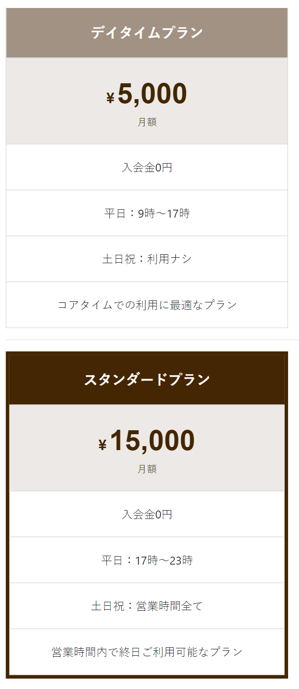

### 作るもの



### ファイル名、ディレクトリ構造

```
src
├ components
│ └ molecules
│   └ plan
│     ├ plan.html
│     └ plan.scss
└ stories
  └ molecules-plan.stories.js
```

### 注意点

- 写真のように、デイタイムプランとスタンダードプランの 2 つを作成しましょう。
- どのように記述すれば、簡潔に書けるか考えましょう。
- どのタグを使えばわかりやすいか考えましょう。
- Css Diner で学んだ nth-child をうまく使ってみましょう。
