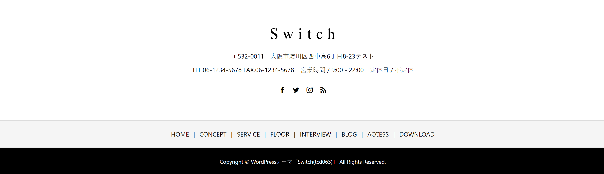

### 作るもの



### ファイル名、ディレクトリ構造

```
src
├ components
│ └ organisms
│   └ footer
│     ├ footer.html
│     └ footer.scss
└ stories
  └ organisms-footer.stories.js
```

### 注意点

- 最後のパーツです！がんばりましょう！
- SNS と RSS のアイコンは、何度か登場した fontawesome を使って実装しましょう。
