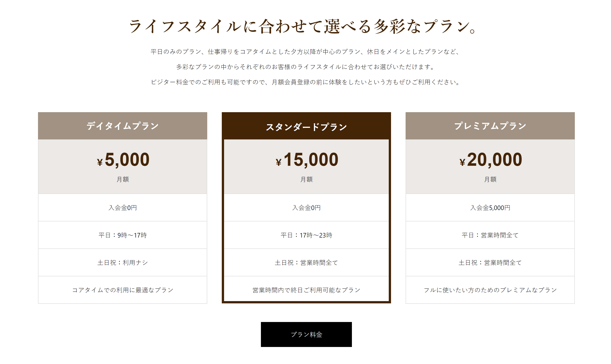

### 作るもの



### ファイル名、ディレクトリ構造

```
src
├ components
│ └ organisms
│   └ plans
│     ├ plans.html
│     └ plans.scss
└ stories
  └ organisms-plans.stories.js
```

### 注意点

- これまで作ってきたパーツですね。組み合わせましょう。
- 実装によっては「フルに使いたい方のためのプレミアムなプラン」が 2 段になってしまうことがありますが、それによるデザイン崩れは許容します。
